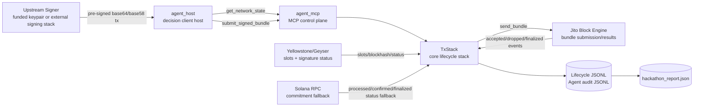
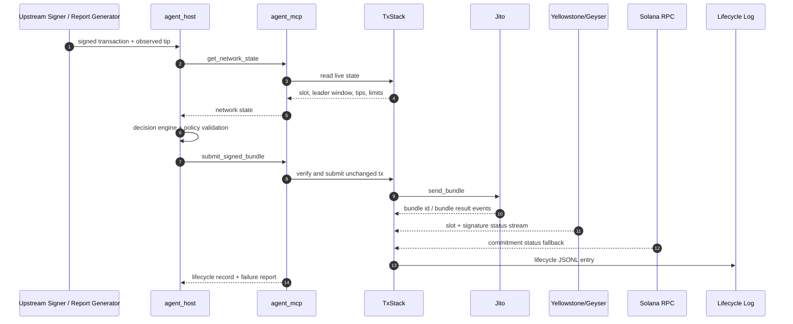
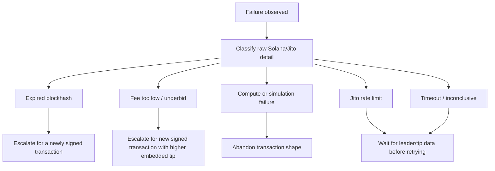

# tx_agent

Live Solana transaction control plane for Jito bundle submission, lifecycle tracking, and failure reporting. It combines Yellowstone/Geyser slot and signature-status streams, live Jito tip data, controlled MCP tooling, and a bounded operational decision layer.

Built for the [Superteam Advanced Infrastructure Challenge: Build a Smart Transaction Stack](https://superteam.fun/earn/listing/advanced-infrastructure-challenge-build-a-smart-transaction-stack).

## Quick Start

There are two ways to run the stack, depending on what you want to demonstrate.

### Example 1: Generate The Report

Use this path to produce the JSON evidence file with 10 live submissions, including at least 2 expected failure cases:

```sh
cargo build --bins

target/debug/hackathon_report \
  --rpc-url "$SOLANA_RPC_URL" \
  --yellowstone-endpoint "$YELLOWSTONE_ENDPOINT" \
  --jito-auth-keypair "$JITO_AUTH_KEYPAIR" \
  --payer-keypair "$TX_AGENT_REAL_PAYER_KEYPAIR" \
  --out reports/hackathon_report.json
```

### Example 2: Run MCP Server And Client Manually

Use this path to run the control plane and submit a pre-signed transaction through the client host.

Start the MCP control-plane server in one shell:

```sh
cargo run --bin agent_mcp -- --bind 127.0.0.1:8080
```

Run the client host against a pre-signed transaction in another shell:

```sh
cargo run --bin agent_host -- \
  --mcp-url http://127.0.0.1:8080/mcp \
  --request-id demo-001 \
  --encoding base64 \
  --transaction-file signed-tx.base64 \
  --observed-tip-lamports 1000
```

## CLI Flags

### `hackathon_report`

| Flag | Meaning |
| --- | --- |
| `--rpc-url` | Solana RPC endpoint used to fetch fresh blockhashes and query transaction commitment. Can also be set with `SOLANA_RPC_URL`. |
| `--yellowstone-endpoint` | Yellowstone/Geyser gRPC endpoint used for live slots, blockhashes, and signature status. Can also be set with `YELLOWSTONE_ENDPOINT`. |
| `--jito-auth-keypair` | Path to the Jito auth keypair used by the MCP server when connecting to the block engine. Can also be set with `JITO_AUTH_KEYPAIR`. |
| `--payer-keypair` | Path to a funded payer keypair used by the report generator to build the successful live transaction cases. Can also be set with `TX_AGENT_REAL_PAYER_KEYPAIR`. |
| `--out` | Path where the final JSON report is written. Defaults to `hackathon_report.json`. |
| `--work-dir` | Directory for generated signed transaction files, lifecycle JSONL, and MCP server logs. Defaults to a temp directory. |
| `--request-prefix` | Prefix used for generated submission IDs in the report and lifecycle log. |
| `--success-count` | Number of expected-success submissions to generate. Defaults to `8`. |
| `--failure-count` | Number of expected-failure submissions to generate. Defaults to `2`; must be at least `2`. |
| `--tip-lamports` | Tip amount, in lamports, used when generating report transactions and recorded in lifecycle metadata. Defaults to `1000`. |
| `--tip-account` | Jito tip account used in generated transfer transactions. Defaults to the built-in Jito tip account. |
| `--bind` | Local address used for the MCP server started by the report generator. Defaults to `127.0.0.1:18080`. |
| `--yellowstone-connect-timeout-secs` | Timeout used for Yellowstone/Geyser connect and subscribe calls before the stream reconnects. Defaults to `30`. The stack can still use RPC slot/status fallback while Yellowstone reconnects. |
| `--confirmation-timeout-secs` | How long the stack waits for processed/confirmed/finalized evidence before classifying a timeout. |
| `--leader-lookahead-slots` | How close a connected Jito leader must be before a leader-aware submission proceeds. |
| `--max-agent-wait-slots` | Maximum wait window allowed by policy for the client decision loop. |
| `--server-ready-timeout-secs` | How long the report generator waits for `agent_mcp` to open its local port. The MCP server opens the port only after observing a slot advance. |
| `--submission-timeout-secs` | Per-submission timeout for the `agent_host` process. |

### `agent_mcp`

| Flag | Meaning |
| --- | --- |
| `--bind` | Address where the MCP streamable HTTP server listens, for example `127.0.0.1:8080`. |

### `agent_host`

| Flag | Meaning |
| --- | --- |
| `--mcp-url` | MCP server URL, usually `http://127.0.0.1:8080/mcp`. Can also be set with `MCP_SERVER_URL`. |
| `--request-id` | Stable submission identifier written to lifecycle logs and decision audit logs. |
| `--encoding` | Encoding of the signed transaction payload. Supported values are `base64` and `base58`. |
| `--transaction-file` | Path to a file containing the already signed encoded transaction. Use this or `--encoded-transaction`, not both. |
| `--encoded-transaction` | Inline already signed encoded transaction string. Use this or `--transaction-file`, not both. |
| `--observed-tip-lamports` | Metadata telling the stack how many lamports of Jito tip the already-signed transaction is expected to contain. The stack records this value but does not modify the transaction. |

> [!IMPORTANT]
> `hackathon_report` performs real Jito bundle submissions. Use a funded payer keypair only when you intend to spend fees/tips on live infrastructure.

## Architecture Document

The submission requires a public architecture document hosted separately from this GitHub repository.

Public architecture document: **TODO: replace with your public Figma, Notion, Google Docs, or other public URL before submission.**

That external document should cover:

- System architecture
- Key components
- Data flow between services
- Infrastructure decisions
- Failure handling strategy
- Decision-layer responsibilities
- Diagrams and deployment notes

The repository implementation is summarized below, but the externally hosted document is the separately judged architecture submission.

## System Overview



The project separates core infrastructure from decision orchestration:

| Area | Path | Responsibility |
| --- | --- | --- |
| Core stack | `src/core` | RPC, Yellowstone, Jito, lifecycle logging, MCP server |
| Decision layer | `src/ai` | Operational decision policy, MCP client host |
| Binaries | `src/bin` | `agent_mcp`, `agent_host`, `hackathon_report` |

## Key Components

| Component | Role |
| --- | --- |
| `agent_mcp` | Long-running MCP streamable HTTP server at `/mcp`. Owns live infrastructure and controlled write tools. It waits for a slot advance before accepting requests. |
| `agent_host` | MCP client and decision host. Receives an already signed transaction, queries live state, validates the decision, then calls MCP tools. |
| `TxStack` | Verifies signed transactions, submits Jito bundles, tracks lifecycle, and writes JSONL records. |
| `JitoClient` | Connects to the Jito block engine, fetches leader windows, submits bundles, and receives bundle events. |
| `Geyser` | Streams live slots, blockhashes, and signature status from Yellowstone/Geyser. |
| `hackathon_report` | Starts the MCP server, generates live transaction cases, runs the agent, and writes the final JSON report. |

## Data Flow



## Infrastructure Decisions

- The agent never signs transactions, mutates instructions, refreshes blockhashes, or changes embedded tips.
- `agent_mcp` owns all Solana/Jito network access so the write surface is narrow and auditable.
- Yellowstone/Geyser is the primary live signal for slots and signature status.
- RPC commitment checks are used as corroborating fallback, not as the only lifecycle source.
- Lifecycle records are append-only JSONL so the raw evidence is easy to inspect and preserve.
- `hackathon_report` embeds the raw lifecycle records into a final JSON report for judging.

## Failure Handling Strategy



The signature boundary controls recovery. If a blockhash expires or a higher tip is required, this agent cannot repair the transaction in-place. It must escalate to an upstream signer for a new signed payload.

## Decision Layer Responsibilities

The decision layer can choose:

- `submit_now`
- `wait_for_leader`
- `retry`
- `abandon`
- `escalate`

The policy layer clamps or rejects unsafe decisions. The decision layer cannot:

- Access private keys
- Sign transactions
- Mutate transaction instructions
- Refresh blockhashes
- Increase embedded tips
- Call Solana or Jito directly

## Lifecycle Log And Hackathon Report

Each lifecycle JSONL record includes:

- `submission_id`
- `attempt`
- `bundle_id`
- `signature`
- `tip_lamports`
- Submitted, processed, confirmed, and finalized timestamps
- Submitted, processed, confirmed, and finalized slots where available
- Latency deltas in milliseconds
- Failure classification and raw failure detail
- Ordered stage events

The final report is written by `hackathon_report`:

```sh
target/debug/hackathon_report \
  --rpc-url "$SOLANA_RPC_URL" \
  --yellowstone-endpoint "$YELLOWSTONE_ENDPOINT" \
  --jito-auth-keypair "$JITO_AUTH_KEYPAIR" \
  --payer-keypair "$TX_AGENT_REAL_PAYER_KEYPAIR" \
  --out reports/hackathon_report.json
```

Report fields relevant to judging:

| Requirement | JSON location |
| --- | --- |
| 10 real submissions | `summary.total_submissions` |
| At least 2 failures | `summary.observed_failures` |
| Slot numbers | `submissions[].validation.slot_numbers` and `submissions[].lifecycle` |
| Commitment progression | `submissions[].validation.commitment_progression` and `submissions[].lifecycle.events` |
| Timestamps | `transaction.constructed_at`, `agent.started_at`, `agent.finished_at`, lifecycle timestamps |
| Tip amounts | `submissions[].transaction.tip_lamports`, lifecycle `tip_lamports` |
| Failure classification | `submissions[].validation.failure_classification`, lifecycle `failure` |

## Setup

Required environment:

```sh
export YELLOWSTONE_ENDPOINT="https://your-yellowstone-endpoint"
export YELLOWSTONE_TOKEN="optional-token"
export SOLANA_RPC_URL="https://your-rpc"
export JITO_AUTH_KEYPAIR="$HOME/.config/solana/jito-auth.json"
export TX_AGENT_REAL_PAYER_KEYPAIR="$HOME/.config/solana/funded-payer.json"
```

`JITO_AUTH_KEYPAIR` must point to a 32-byte seed JSON array used with `Keypair::from_seed`. `TX_AGENT_REAL_PAYER_KEYPAIR` should be a funded Solana keypair used only by the report generator to build successful live transaction cases.

Optional environment:

```sh
export JITO_BLOCK_ENGINE_URL="https://frankfurt.mainnet.block-engine.jito.wtf"
export LIFECYCLE_LOG="lifecycle.log.jsonl"
export YELLOWSTONE_CONNECT_TIMEOUT_SECS=30
export LEADER_LOOKAHEAD_SLOTS=3
export TIP_FLOOR_LAMPORTS=1000
export CONFIRMATION_TIMEOUT_SECS=90
export OPENAI_API_KEY="optional"
export OPENAI_MODEL="gpt-4.1-mini"
export MAX_AGENT_TIP_LAMPORTS=1000000
export MAX_AGENT_RETRIES=2
export MAX_AGENT_WAIT_SLOTS=8
export MCP_BIND_ADDR="127.0.0.1:8080"
export MCP_SERVER_URL="http://127.0.0.1:8080/mcp"
```

## MCP Tools

The MCP server exposes:

- `get_network_state`: current slot, latest streamed blockhash slot, nearest Jito leader, recent tips, and policy limits.
- `get_recent_tip_data`: recent Jito tip percentiles.
- `classify_failure`: maps raw Solana/Jito errors into the failure taxonomy.
- `submit_signed_bundle`: verifies an encoded pre-signed transaction, submits it unchanged as a Jito bundle, tracks lifecycle, classifies failures, and logs the outcome.
- `record_agent_decision`: appends the agent input state, decision, validation policy, and outcome.

## README Questions

### Question 1: What does the delta between `processed_at` and `confirmed_at` tell you about network health at the time of submission?

The delta measures how long it took after the transaction first appeared at processed commitment for enough stake-weighted voting to confirm it. A small delta usually means the leader produced the block, shreds propagated quickly, validators voted promptly, and the RPC/Geyser view was healthy. A widening delta points to network stress: slow shred propagation, voting lag, fork pressure, overloaded RPC infrastructure, or congestion that delays confirmation even after a transaction is first observed.

In this stack, that delta is useful because `processed_at` is the earliest practical landing signal, while `confirmed_at` is the stronger signal that the cluster is converging on that block. The report preserves both timestamps and slot numbers so the delta can be compared across submissions in the same run.

### Question 2: Why should you never use finalized commitment when fetching a blockhash for a time-sensitive transaction?

Finalized commitment is too old for latency-sensitive submission. A Solana transaction blockhash has a limited lifetime. Fetching a finalized blockhash waits for deep consensus before the transaction is even built, which wastes part of the validity window and increases the chance that the transaction expires before it reaches a leader.

For Jito bundle flow, that is especially harmful because the sender may wait for a connected leader window. Using a fresh processed or confirmed blockhash preserves more lifetime for signing, routing, bundle forwarding, and leader execution.

### Question 3: What happens to your bundle if the Jito leader skips their slot?

If the targeted Jito leader skips its slot, the bundle cannot land in that leader's block because no block was produced for that opportunity. Depending on timing and blockhash lifetime, the bundle may be dropped, remain unlanded until it expires, or need to be resent for a later leader window.

This stack treats that as an operational failure path. It records the slot and bundle lifecycle evidence, classifies any returned Jito/Solana failure detail, and lets the decision layer choose whether to wait, retry the same still-valid signed payload, abandon, or escalate for a new signed transaction with a fresh blockhash and possibly a different tip.
